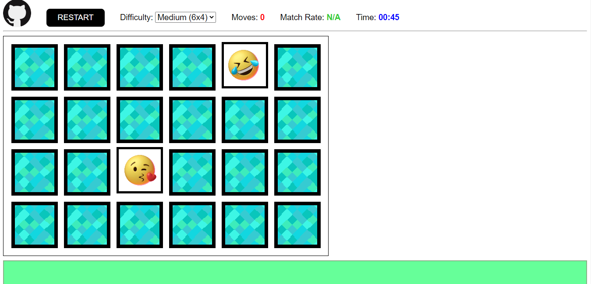

# Matching Pairs
 Simple implementation of the card game "Matching Pairs".
 
 You can play it anytime at <https://muller-castro.github.io/Matching-Pairs/> or by downloading this repository and opening `index.html`.
 
## How to play
 
 
 
 The goal is to find all matching pairs of cards with as few moves as possible.
 
 After choosing the board size, you can play the game by clicking on cards.
 
 The first click flips one card. The second click flips another one. The third click on any card hides the two flipped cards.
 
 If both cards match, the card's icon is collected.
 
 The game is over when there's no card left.
